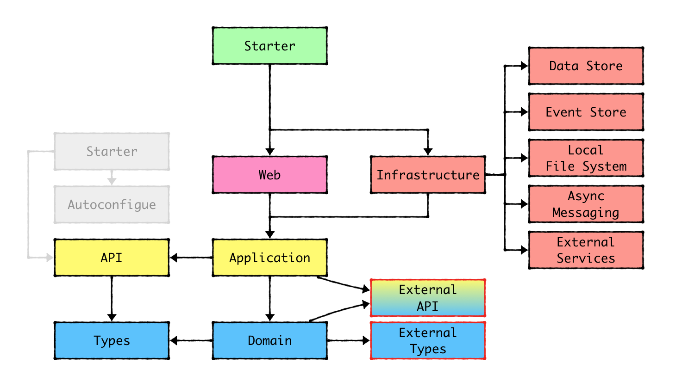

# springboot-ddd-prod-starter
Born to build enterprise apps with SpringBoot and DDD
  
  
目前 boilerplate 先以七個 model 為短期目標。每個 model 有自己的 pom 檔描述依賴關係，
model 若有依賴關係，相依的會是介面，而不是實作。
依賴關係如下圖

## domain model
domain 層，不依賴任何一層。定義跟其他層互動的 interface，因此外層全都會依賴 domain 層提供的介面 (外層依賴內層)。
暫定會 domain model 內實作 auth 相關邏輯。

## application model
application 層，僅依賴 domain 層提供的介面。目前監控 profiling 暫定放這。  
auth 會用 aop 的形式做在這層，因此這層會用到 AspectJ aop。  
transaction 會在這邊定義，因此會依賴 spring-boot-starter-jdbc (需要 transaction  這個 annotation). 
密碼加密會放在這層的 auth sub domain，故此層依賴 spring-security-core

## web model
spring boot 層，僅依賴 application，啟動/router/controlle放在這，目前暫定 swagger 相關會放這。

## search model
infra 層，實作 domain 提供的 search interface，依賴 domain 和其他 search lib。

## persistence model
infra 層，用 jpa 實作 domain 定義的介面，僅依賴 domain 和 orm。

## messaging model
infra 層，實作 domain 定義的 mq 介面，僅依賴 domain 和 mq lib。

## external model
外部服務從，僅依賴 domain 和外部服務 lib。
>>>>>>> afe817d (Init project)
